## Lab 1 - Security

Security always comes first.

Let's check and improve our website safity by adding a number of security headers to enforce HTTPS and prevent XSS.

### 1. Scan the website for security vulnerabilities

Go to https://observatory.mozilla.org/ and scan the CloudFront distribution domain name created for you by the CloudFormation stack, `d123.cloudfront.net`.

The result of the scan will be unsatisfactory:

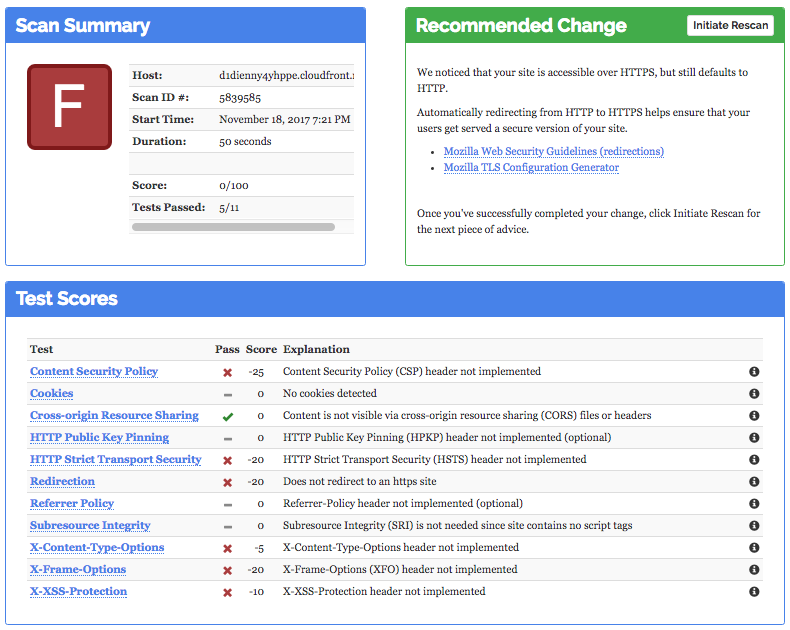

### 2. Create a Lambda function

Create a Lambda function in `us-east-1` region that would add the security headers to all responses from the origin in the CloudFront disribution.

Choose `Node.js 6.10` runtime and IAM role named `ws-lambda-edge-basic-<UNIQUE_ID>`, which was created by CloudFormation stack in your account, as an execution role of the function. This will allow pushing logs from your function to CloudWatch Logs.

Use JavaScript code from [ws-lambda-at-edge-add-security-headers.js](./ws-lambda-at-edge-add-security-headers.js) as a blueprint.

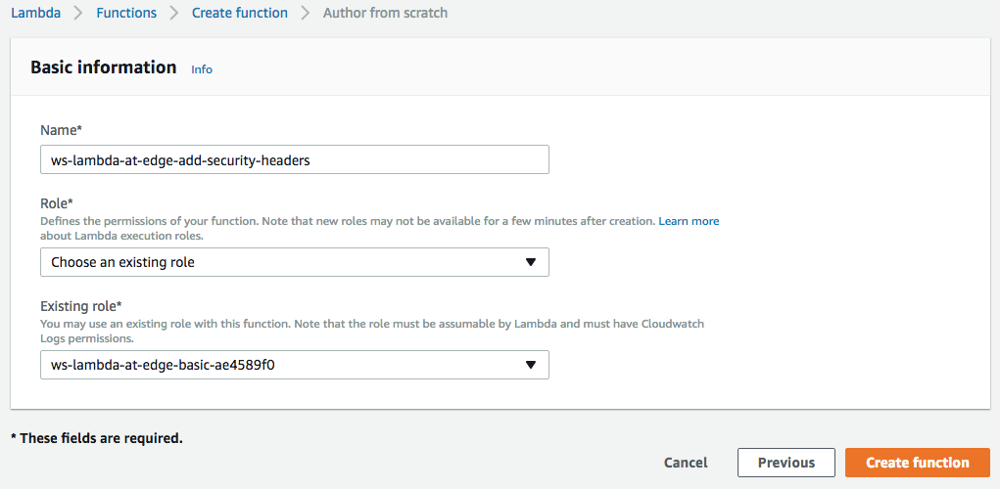

### 3. Validate the function works with test-invoke in Lambda Console

When the function is created and is ready to be associated with a CloudFront distribution, it's highly recommended to first test it to make sure it executes successfully and produces the expected outcome. This can be done using a test invoke in Lambda Console. Save the function and click `Test`.

You will be prompted with a window that allows you to create a test event - an input for your function. Use the event template called "CloudFront Modify Response Header".

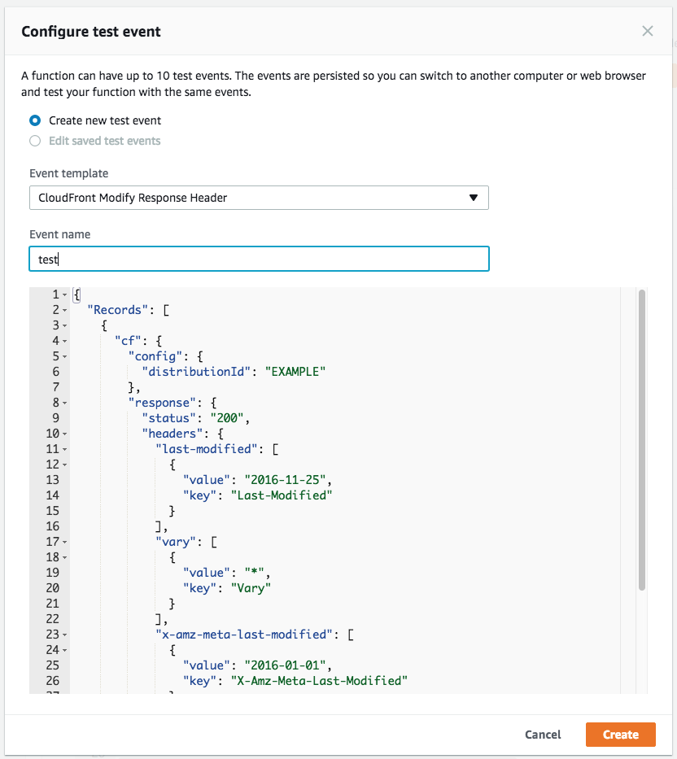

Now the function can be tested with the configured test event.  
Validate that the security headers are now seen in the the execution result of the test invocation.

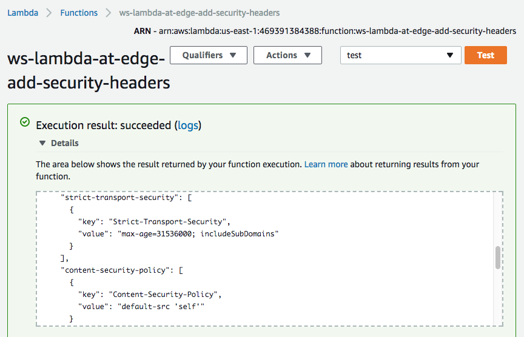

### 4. Publish the function version

Save and publish the function to get a function version ARN.

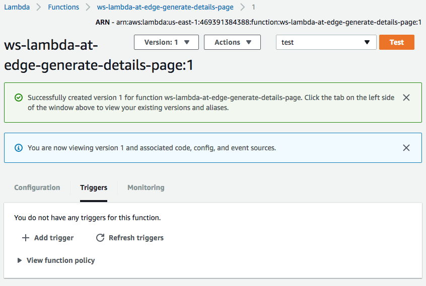

### 5. Add a trigger

Associate the function with origin-response trigger of the CloudFront distribution.

This can be done either in Lambda or CloudFront Console.

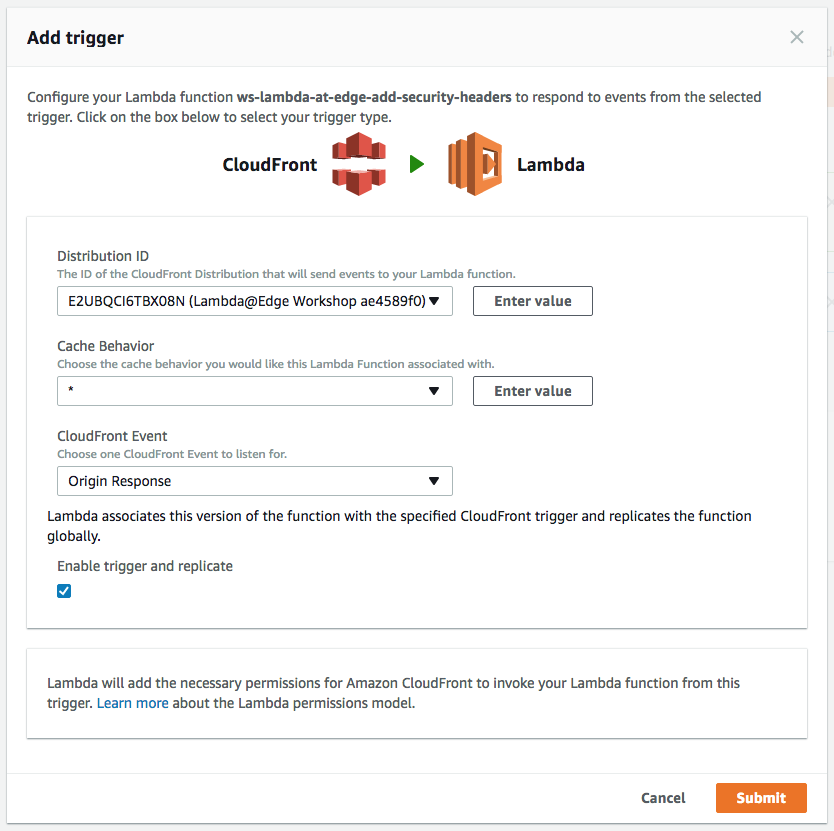

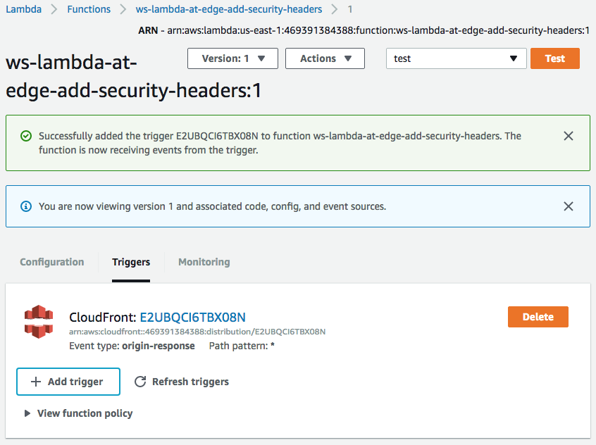

### 6. Configure HTTP to HTTPs redirect.

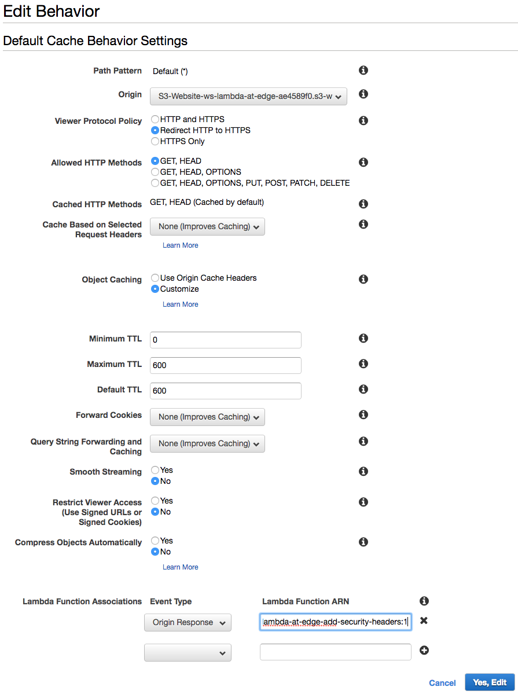

### 7. Wait for the change to propagate

Usually ~30-60sec is enough. To be certain you can wait until the change is fully deployed as reported by the CloudFront Console.

### 8. Invalidate CloudFront cache

In order to purge any objects cached without the security headers, submit wildcard invalidation '/*' using CloudFront Console.

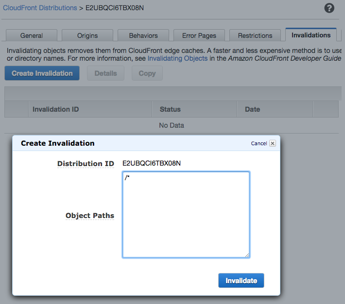

### 9. Validate the security headers are now seen in the responses

Use browser developer tools.

Use command line: curl --head https://d123.cloudfront.net

### 10. ReScan the website for security

Re-scan it with https://observatory.mozilla.org/

Now you have 100/100 score! :)

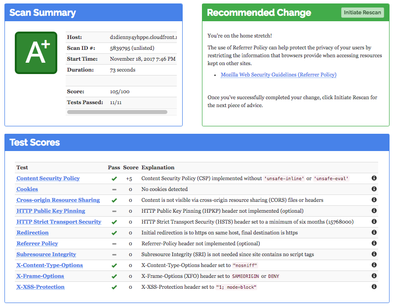

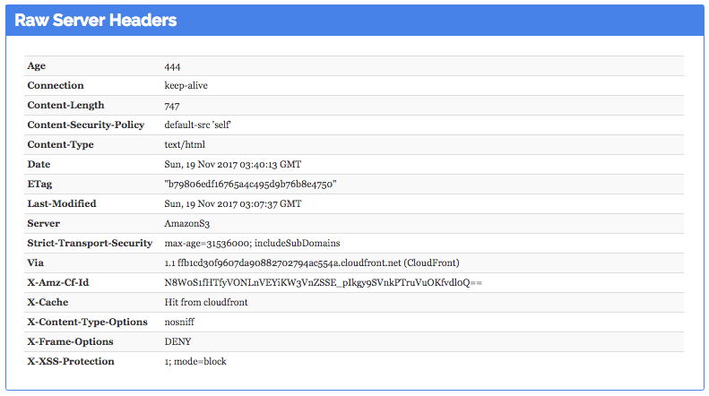
