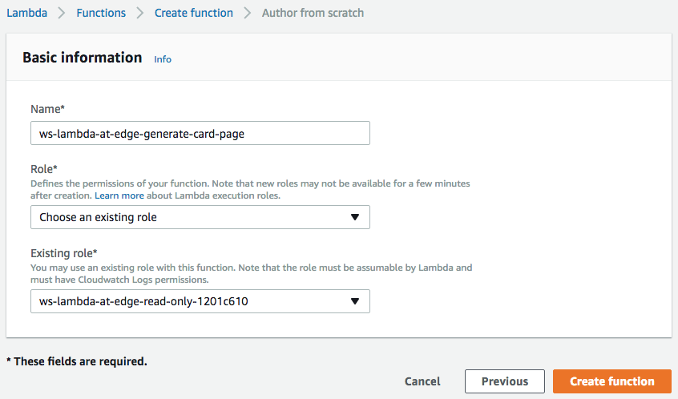
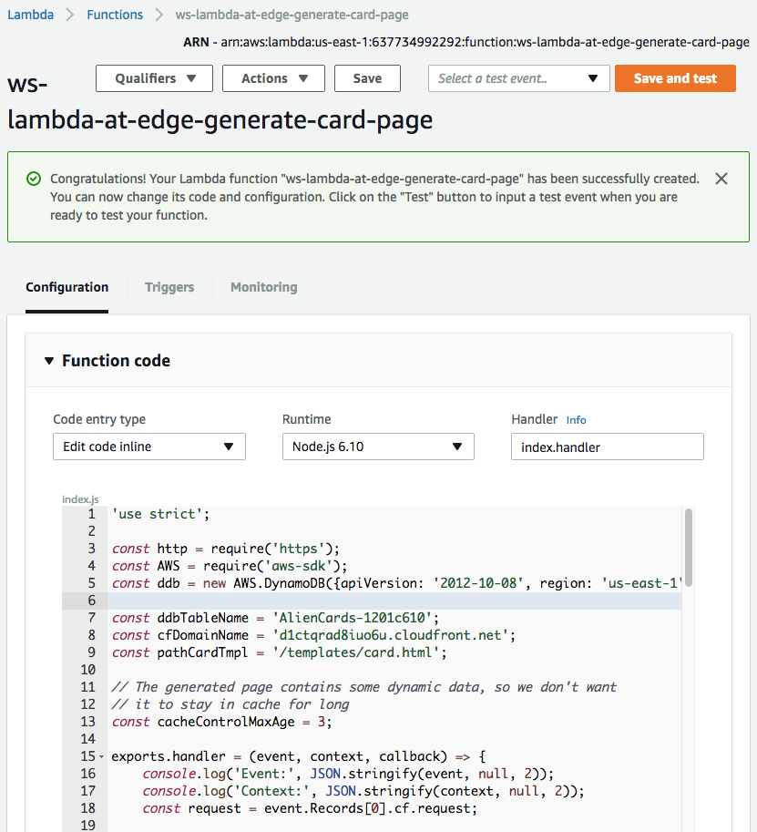
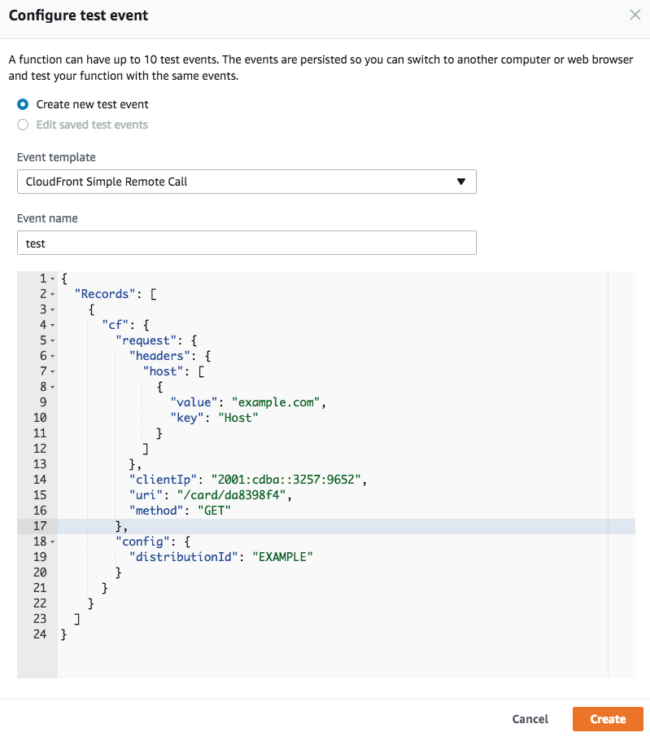
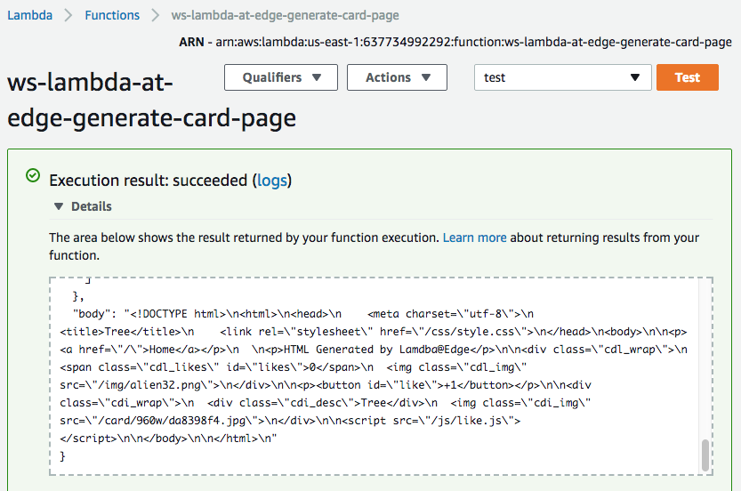
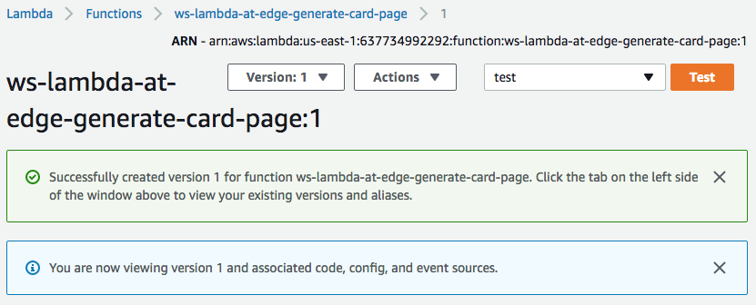
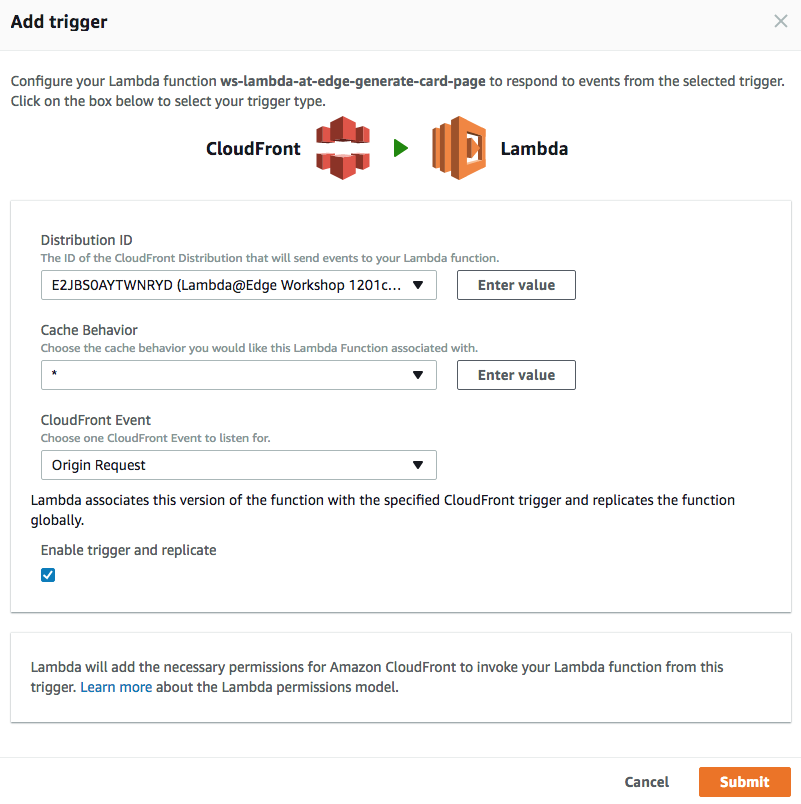
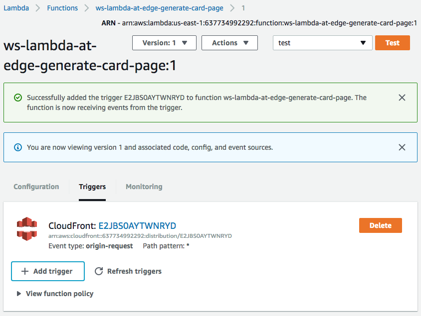
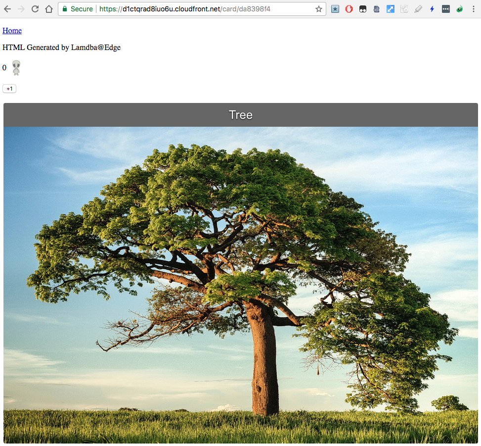

## Lab 2 - Content Generation

With Lambda@Edge you can not only modify request and responses by URIs, cookies, headers and querystrings, but also generate content by returning a response object from a Lambda function triggered by viewer-request ot origin-request events. In this case, instead of futher processing the request, CloudFront will respond back to the viewer with the content generated by your Lambda function.

In this lab, you will learn how to create a Lambda function that dynamically generates HTML content that can be cached by CloudFront and returned back to your viewers.

If you navigate your web browser to the domain name of the CloudFront distribution created by CloudFormation for this workshop, you will find that the distribution just points to an S3 bucket with some static HTML content and jpeg files.

The home page of the CloudFront distribution (replace the `d123.cloudfront.net` domain name with the unique name of your distribution) displays a static HTML page with a list of images:  
https://d123.cloudfront.net

If you click on a particular image, you will be forwarded to a jpeg file:  
https://d123.cloudfront.net/card/960w/da8398f4.jpg

In this lab, we will create two lambda functions.

The first one will generate a simple HTML page with card details available at the URL like this:  
https://d123.cloudfront.net/card/da8398f4  

The second Lambda function will generate a new dynamic home page showing more details about each of the displayed cards - description and the current rating. It will also sort the cards so that the most popular ones are displayed at the top.

We will generate the content in Lambda functions triggered by origin-request event so that the generated HTML files can be cached by CloudFront. Even if the TTL is a few seconds it will still absorb traffic spikes and lower the number of function executions.

### 1. Content generation for the card details page

Let's create a Lambda function that generates HTML reposes to card details page, such as  
https://d123.cloudfront.net/card/da8398f4

#### 1.1 Create a Lambda function

Create a Lambda function in `us-east-1` region. Choose `Node.js 6.10` runtime and the IAM role named `ws-lambda-edge-read-only-<UNIQUE_ID>`, which was created by CloudFormation stack in your account, as an execution role of the function. This will allow the function to read data from the DynamoDB table and also get object from the S3 bucket.

Use JavaScript code from [ws-lambda-at-edge-generate-card-page.js](./ws-lambda-at-edge-generate-card-page.js) as a blueprint.

#### 1.2 Validate the function works with test-invoke in Lambda Console

Click "Test" and configure the test event. Specify `/card/da8398f4` as the value of the `uri` field.

Execute the test-invoke and validate the function is executed with `200` status code and the `body` field contains a meaningful HTML document.

#### 1.3 Publish a function version

Choose "Publish new version" under "Actions", specify an optional description of a function version and click "Publish".

#### 1.4 Create a trigger

Choose "Add trigger" under "Triggers", you will be presented with an "Add trigger" dialog:
* In the "Distribution ID" field, find the CloudFront distribution created for this workshop.  
* Choose the default cache behavior, that is currently the only behavior in the distribution that matches all URI paths with the `*` wildcard.  
* Choose "Origin Request" event type to trigger the function.
* Confirm a global replication of the function by choosing "Enable trigger and replicate"

After the trigger has been created, you will see it in the list of triggers of the function version.

#### 1.5 Validate the generated HTML page in a web browser

Go to the card details page (use your unique CloudFront distribution domain name):  
https://d123.cloudfront.net/card/da8398f4  

You should be seeing a page like this:

### 2. Content generation for the home page
