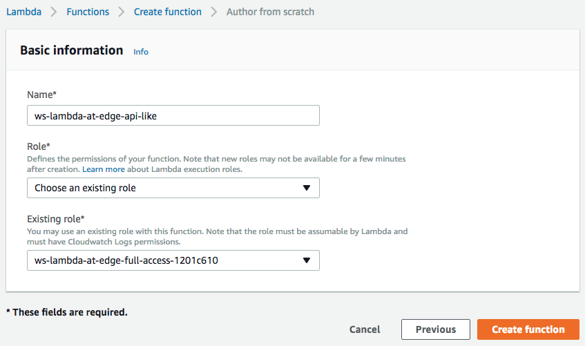
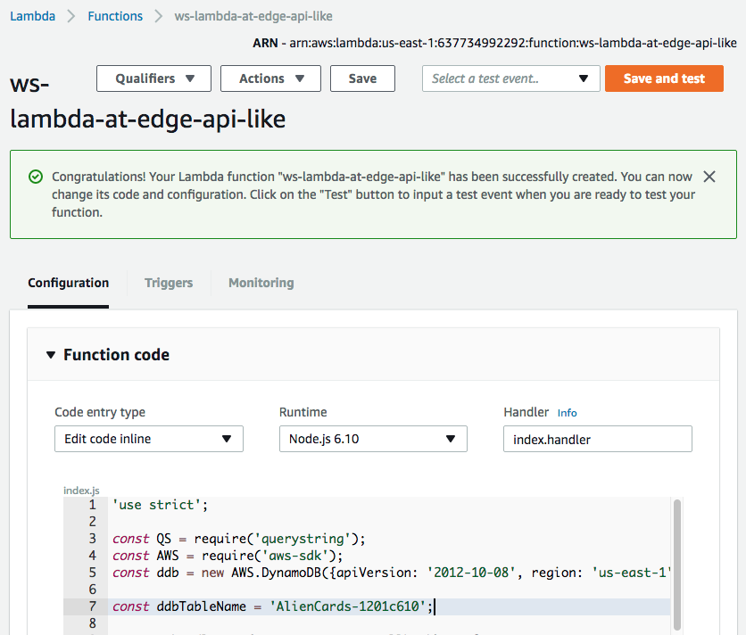
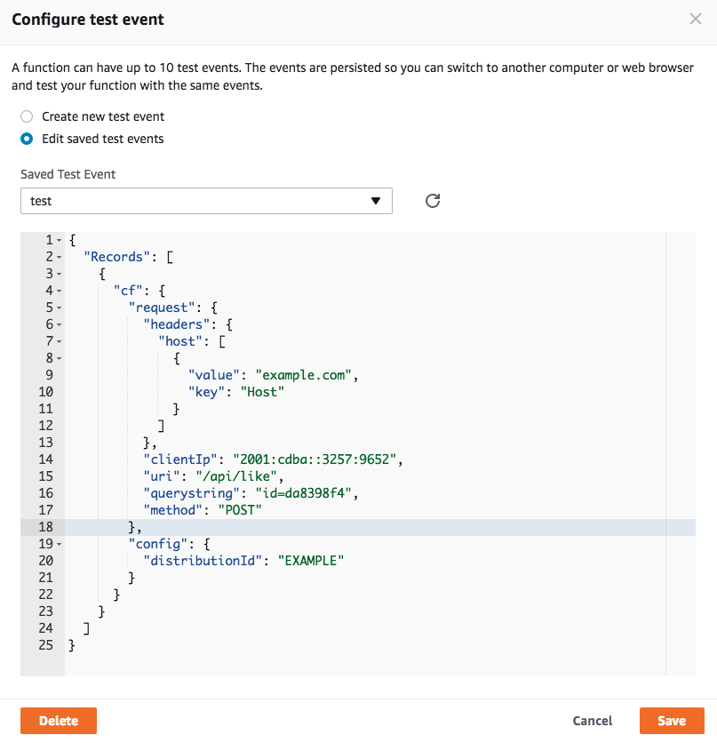
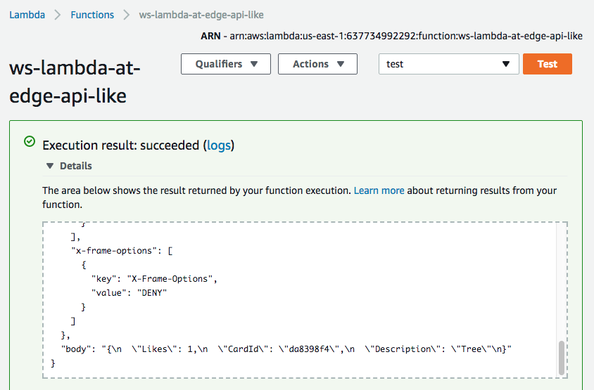
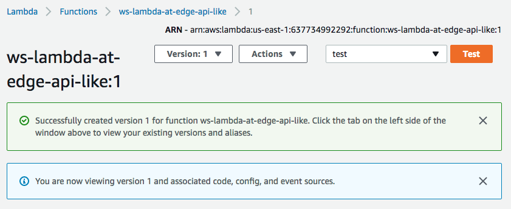
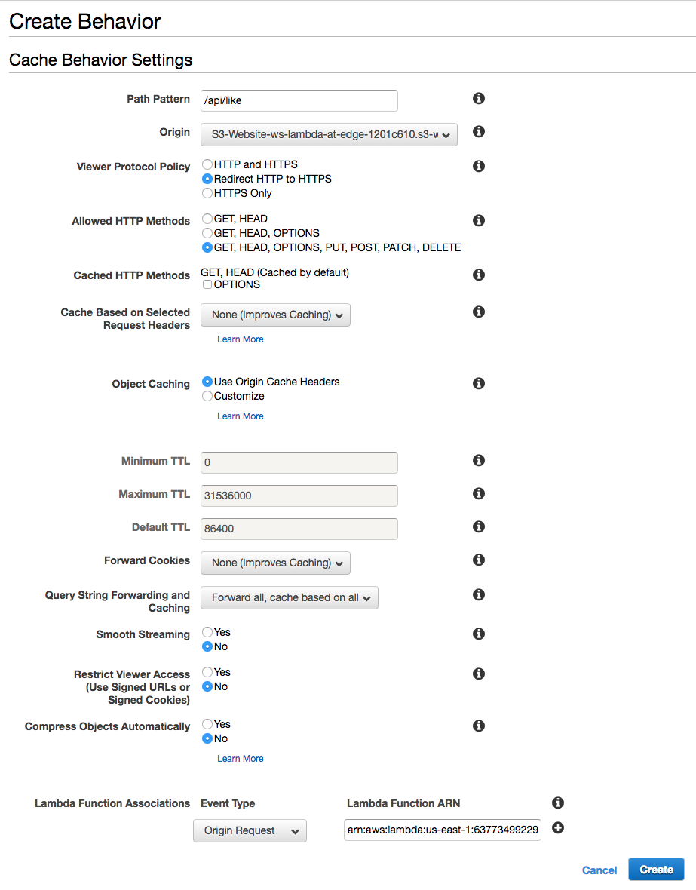
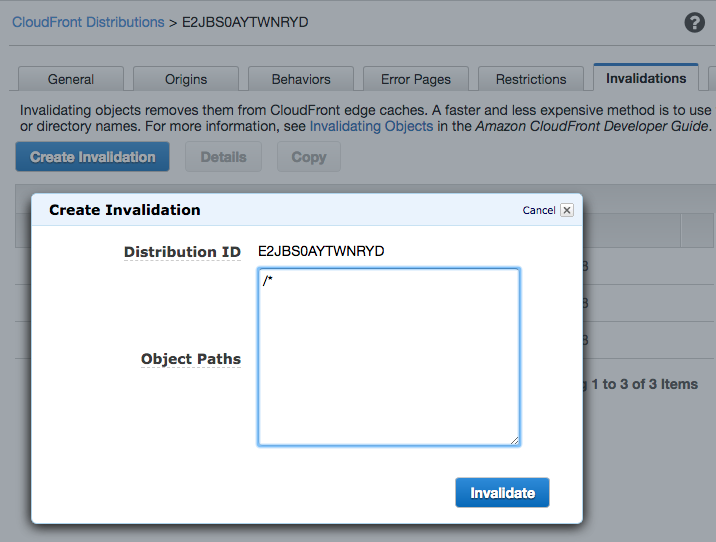
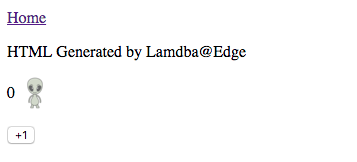
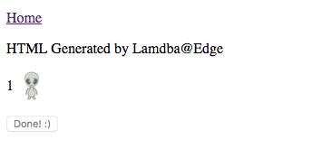
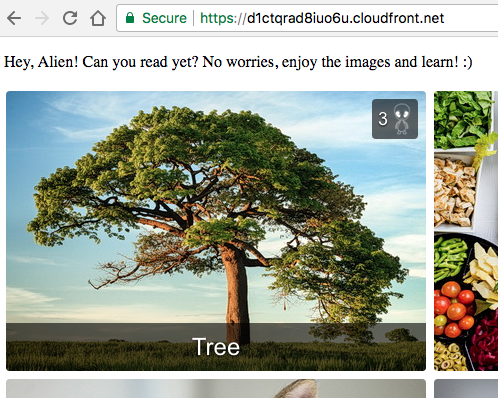

## Lab 3: Simple API

In order to make our simple website a little bit more interactive we should be able to accept some feedback from the viewers and reflect it in the dynamically generated pages. In the previous lab, we made our home page list the cards in the most-rated first order, but have not yet implemented a way for our viewers to submit the "+1" feedback.

In this lab, you will learn how you can use Lambda@Edge to implement a simple API that accepts POST requests from the viewers and modifies the web application state in a DynamoDB table.

Let's imeplment an API that accepts HTTP POST requests in the format below and increments the rating of a card in the Dynamo DB table:
```
POST /api/like?id=<card_id>
```

### 1. Create a Lambda functon

Similar to how we did it in the previous labs, create a Lambda function in the `us-east-1` region, `Node.js 6.10` runtime and the IAM role named `ws-lambda-edge-full-access-<UNIQUE_ID>`.

Use JavaScript code from [ws-lambda-at-edge-api-like.js](./ws-lambda-at-edge-api-like.js) as a blueprint.





### 2. Validate the function works with test-invoke in Lambda Console

Click "Test" and configure the test event. You can use "CloudFront Simple Remote Call" event template. 

Specify `/api/like` and `id=da8398f4` as the values of the `uri` and `querystring` fields respectively.



Execute the test-invoke and validate the function has returned `200` status code and the `body` field contains a meaningful HTML document.



### 3. Publish a function version

Choose "Publish new version" under "Actions", specify an optional description of a function version and click "Publish".



### 4. Create cache behavior for the API URI

Go to CloudFront Console and find the distribution created for this workshop. Under the "Behaviors" tab, click "Create Behavior". Choose the following settings:
* Path Pattern: /api/like
* Viewer Protocol Policy: "Redirect HTTP to HTTPS"
* Query String Forwarding and Caching: "Forward all, cache based on all"
* Lambda Function Associations: Origin Request = <lambda version ARN from the previous step>
  


### 5. Invalidate CloudFront cache

CloudFront may have already cached the erorr response code if you tried to click "+1" before implemeting the API. Submit a wildcard invalidation '/*' to invalidate the cache.



### 6. The API works now!

You can validate it with either a command line:

```
curl -X POST https://d123.cloudfront.net/api/like?id=da8398f4
{
  "Likes": 4,
  "CardId": "da8398f4",
  "Description": "Tree"
}
```
Or simple go to https://d123.cloudfront.net/card/da8398f4 in your web browser and click "+1"



becomes:



The home page should also now reflet the change and list the cards according to their rating:


