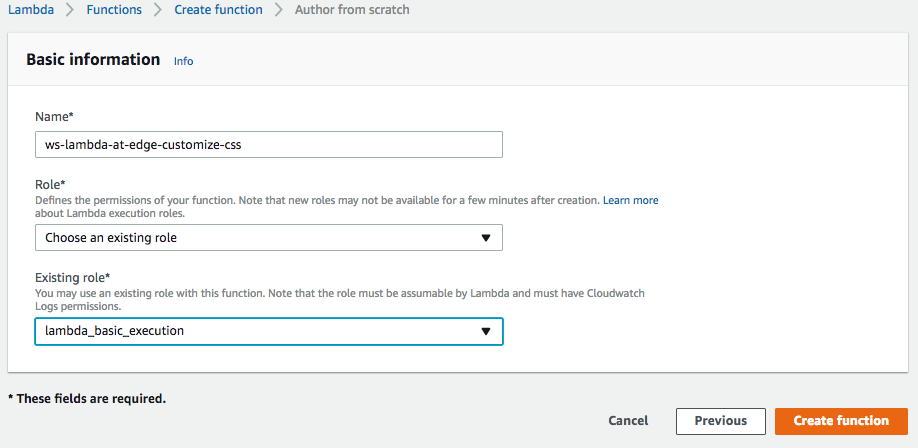
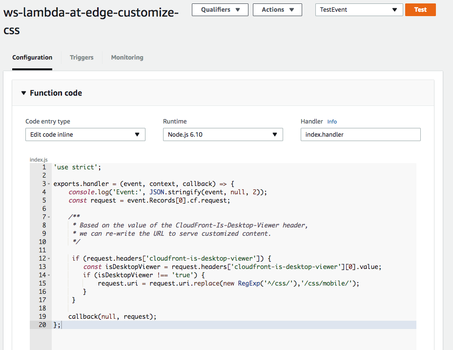
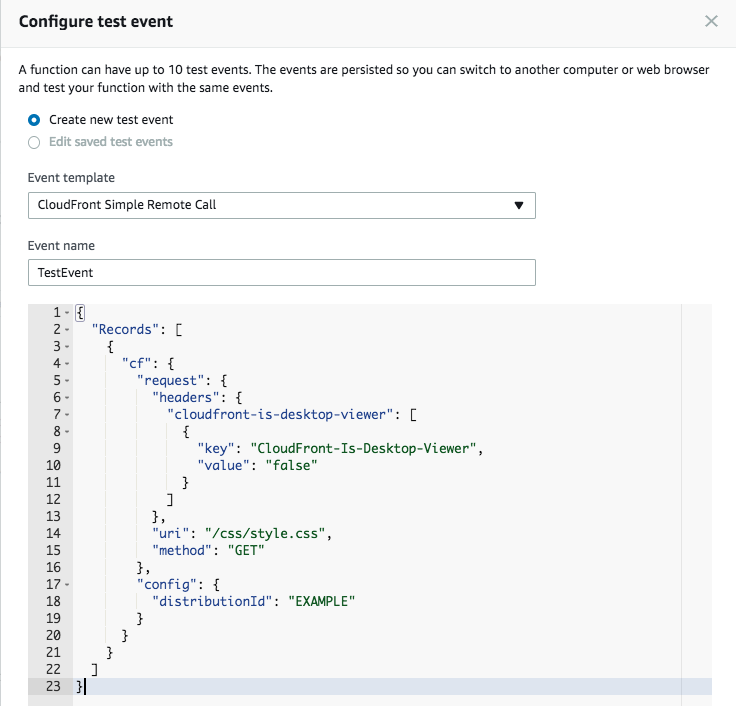
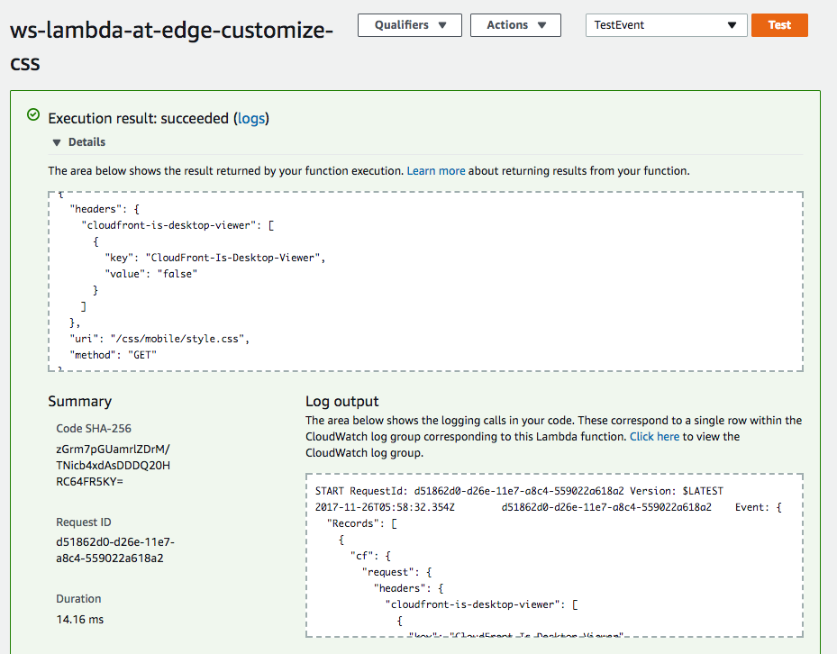
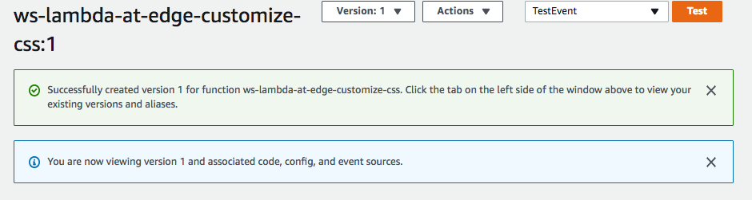
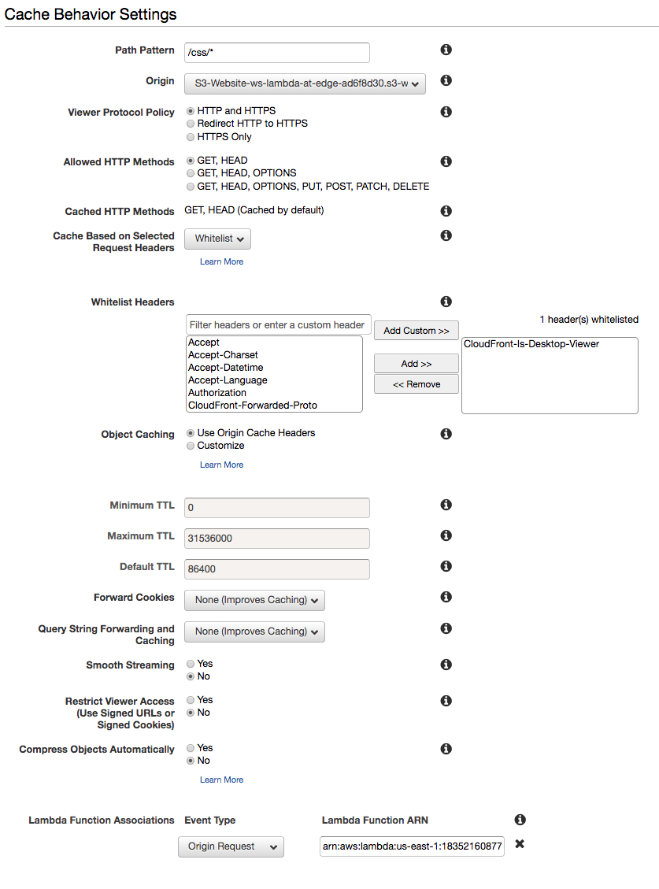
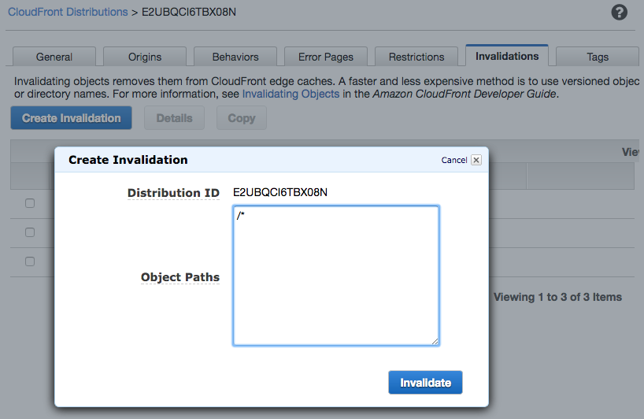
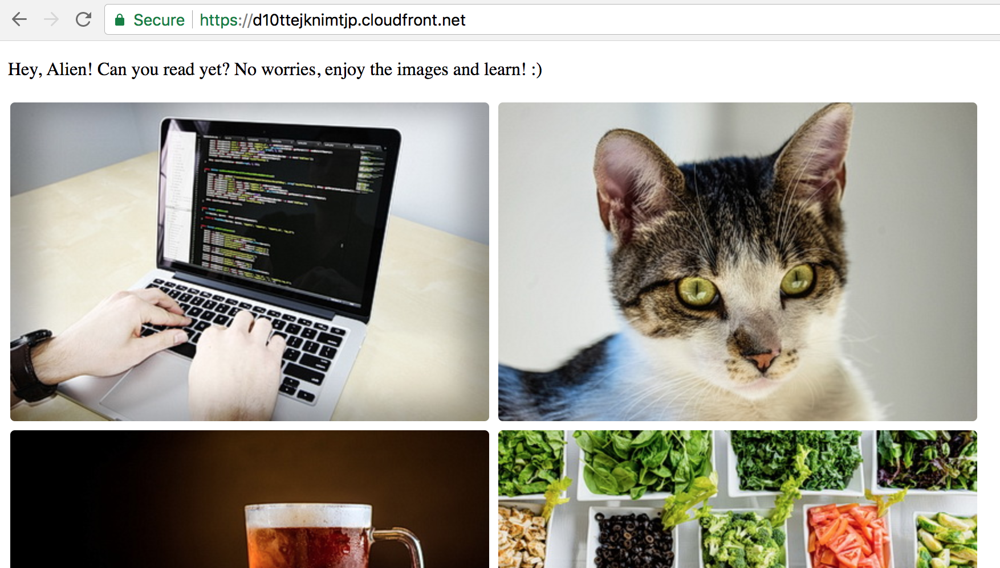
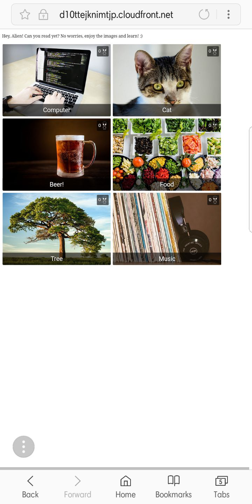

## Lab 5 - Content Customization

We can serve different content from S3 bucket by changing the path prefix
depending on CloudFront headers like:

  CloudFront-Is-Mobile-Viewer
  CloudFront-Is-Desktop-Viewer
  etc

For example:
  GET /css/style.css

can be rewritten to
  GET /css/style.css       # for desktop viewers
  GET /css/mobile/style.css       # for mobile viewers

In this lab, you will learn how to create a Lambda function that customizes the content based upon different paramter in customer request.

If you open the homepage of the CloudFront distribution, you set up in previous steps, on a mobile phone, you'd not be able to see titles and like-count as you can't hover in cell phone. If you try to hover, you may endup clicking it and landing on detail page. In this exercise, we'd serve differnet CSS based on viewer device type. If a request if coming from a mobile device, we'd serve a different CSS which always show the title and likes on home page. 

**NOTE:** Here and below throughout the workshop, replace the example domain name `d123.cloudfront.net` with the unique name of your distribution.

#### 1 Create a Lambda function

Create a Lambda function in `us-east-1` region. Choose `Node.js 6.10` runtime and the IAM role named `ws-lambda-at-edge-read-only-<UNIQUE_ID>`, which was created by CloudFormation stack in your account, as an execution role of the function. This will allow the function to read data from the DynamoDB table and also get object from the S3 bucket.

Use JavaScript code from [ws-lambda-at-edge-customize-css.js](./ws-lambda-at-edge-customize-css.js) as a blueprint.

#### 2 Validate the function works with test-invoke in Lambda Console

Click "Test" and configure the test event. You can use "CloudFront Simple Remote Call" event template. Add  sample test-event from [ws-lambda-at-edge-customize-css-test-event.json](./ws-lambda-at-edge-customize-css-test-event.json) as an example. Use uri as 'css/style.css'

Execute the test-invoke and validate the function has returned `200` status code and the uri is updated to css/mobile/style.css.

#### 3 Publish a function version

Choose "Publish new version" under "Actions", specify an optional description of a function version and click "Publish".

#### 4 Create a new cache behavior for the CSS in your CloudFront distribution

Go to Services -> CloudFront. Select the distribution which was created by CloudFormation stack in your account. Click "Distribution Settings". Under the "Behaviors" tab, click "Create Behavior". Choose the following settings:

* Path Pattern: /css/*
* Origin: S3-bucket
* Cache Based on Selected Request Headers: Whitelist
* Whitelist Headers: Type in "CloudFront-Is-Desktop-Viewer" and click "Add Custom >>"
* Lambda Function Associations: Origin Request = Arn of the function VERSION just created in last step. e.g. arn:aws:lambda:us-east-1:1234567890:function:ws-lambda-at-edge-customize-css:1 
And then click "Create"

#### 5 Wait for the change to propagate

After any modification of a CloudFront distribution, the change should be propagated globally to all CloudFront edge locations. The propagation status is indicated as "In Progress" and "Deployed" when it's complete. Usually ~30-60seconds is enough for the change to take effect, even though the status may be still "In Progress". To be 100% certain though you can wait until the change is fully deployed.

#### 6 Invalidate CloudFront cache

CloudFront may have already cached the old version css, let's purge any stale objects from the cache. Submit a wildcard invalidation '/*'.

#### 7 The generated home page is now fetching css based upon device.

Go to the distribution home page (from desktop):  
https://d123.cloudfront.net/

You should be seeing a page like this:

Go to the distribution home page (from mobile):  
https://d123.cloudfront.net/

You should be seeing a page like this:

