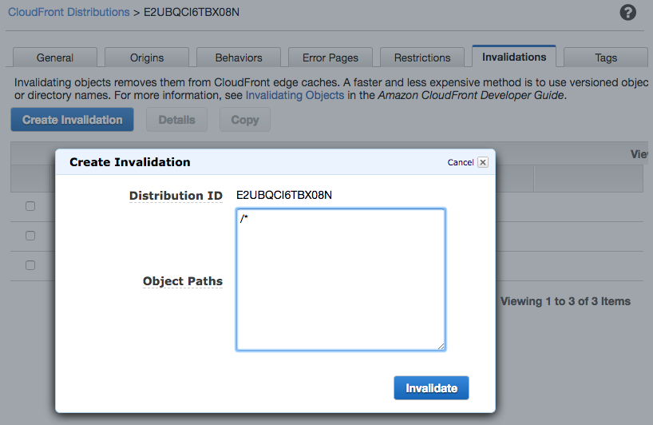

## Lab 6 - Origin Selection

With Lambda@Edge you can also modify the origin for a request. Depending on where request is being served from you can select a nearest origin. You may also select a different origin based upon reqest to serve custom content. In this case, instead of going to the configured origin, CloudFront will send request to origin updated in the request events.

In this lab, you will learn how to create a Lambda function that changes origin to serve content from nearby region. Depending on the region where the viewer is located (i.e. closest to the viewer), we'll select the closest of the two origins - US bucket or EU bucket

Currently the images served by your CloudFront distribution created by CloudFormation for this workshop, are read from an S3 bucket located in us-east-1.
In this lab, we will create a new lambda function which will inspect the request to find the country and select one of the nearest bucket US/EU. We'll inspect CloudFront-Viewer-Country header , set by cloudfront to identify the viewer country and serve content accordingly. Since, we're located in US for this workshop, for demo purpose, we'll also add an override to specify country using querystring.

**NOTE:** Here and below throughout the workshop, replace the example domain name `d123.cloudfront.net` with the unique name of your distribution.

#### 1 Create a Lambda function

Create a Lambda function in `us-east-1` region. Choose `Node.js 6.10` runtime and the IAM role named `ws-lambda-at-edge-read-only-<UNIQUE_ID>`, which was created by CloudFormation stack in your account, as an execution role of the function. This will allow the function to read data from the DynamoDB table and also get object from the S3 bucket.

Use JavaScript code from [ws-lambda-at-edge-select-nearest-origin.js](./ws-lambda-at-edge-select-nearest-origin.js) as a blueprint.

#### 2 Validate the function works with test-invoke in Lambda Console

Click "Test" and configure the test event. You can use "CloudFront Simple Remote Call" event template. Use sample test-event from [ws-lambda-at-edge-select-nearest-origin-test-input.json](./ws-lambda-at-edge-select-nearest-origin-test-input.json) as an example.

Execute the test-invoke and validate the function has returned `200` status code and the origin refers to a bucket in eu-central-1.

#### 3 Publish a function version

Choose "Publish new version" under "Actions", specify an optional description of a function version and click "Publish".

#### 4 Create a new origin

Go to Services -> CloudFront. Select the distribution which was created by CloudFormation stack in your account. Click "Distribution Settings" -> Origins -> "Create Origin".  Choose the following settings:
* Origin Domain Name: amazonaws.com
* Origin Path: /
* Origin Protocol Policy: Match Viewer
And then click "Create"

#### 5 Create cache behavior for the images 

Under the "Behaviors" tab, click "Create Behavior". Choose the following settings:
* Path Pattern: /card/*.jpg
* Origin: Custom-amazonaws.com
* Cache Based on Selected Request Headers: Whitelist
* Whitelist Headers: Type in "CloudFront-Viewer-Country" and click "Add Custom >>"
* Query String Forwarding and Caching: "Forward all, cache based on all"
* Lambda Function Associations: Origin Request = <lambda version ARN from the previous step>
And then click "Create"

#### 7 Wait for the change to propagate

After any modification of a CloudFront distribution, the change should be propagated globally to all CloudFront edge locations. The propagation status is indicated as "In Progress" and "Deployed" when it's complete. Usually ~30-60seconds is enough for the change to take effect, even though the status may be still "In Progress". To be 100% certain though you can wait until the change is fully deployed.

#### 8 Invalidate CloudFront cache

CloudFront may have already cached the old version home page, let's purge any stale objects from the cache. Submit a wildcard invalidation '/*'.

#### 9 The generated card details page is now fetching images from the nearest origin.

Go to the card details page (with country override in url parameter):  
https://d123.cloudfront.net/card/vc7efa69?country=UK  

You should be seeing a page like this:

Go to the card details page (with country override in url parameter):  
https://d123.cloudfront.net/card/vc7efa69?country=US  

You should be seeing a page like this:

